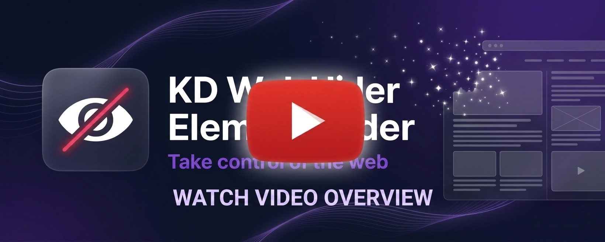

# KD Web Element Hider

A lightweight, high-performance Manifest V3 Chrome Extension for permanently hiding unwanted HTML elements. Remove distracting sidebars, ads, headers, or overlays with a single click to create a cleaner browsing experience.

[](https://www.youtube.com/watch?v=x3Epz70Ffh8)

[](https://developer.chrome.com/docs/extensions/mv3/intro/)
[](LICENSE)
[](https://developer.mozilla.org/en-US/docs/Web/JavaScript)

---

## Tech Stack

- **Manifest V3** — Modern extension architecture
- **Vanilla JavaScript** — Lightweight, zero-dependency logic
- **Chrome Scripting API** — Dynamic content script injection
- **Shadow DOM** — Strong UI layout and style isolation
- **Chrome Storage API** — Local and session-based configuration storage

---

## Key Features

### Core Functionality
- **Single-Click Hiding:** Simply launch the visual selector, hover over any element, and click it directly to remove it instantly (or use the floating tooltip for parent/child navigation).
- **Deep DOM Navigation:** The selector tooltip provides "Parent" and "Back" controls to easily select outer wrapping containers, equipped with a short 500 ms selection delay to prevent accidental clicks.
- **Smart Group Hiding:** Automatically detects repeating class structures. For example, hiding one sponsored post can automatically offer to hide all similar sponsored cards on the page.
- **Persistent Rules:** Hiding rules are automatically re-applied every time you revisit the website.
- **Rule Diagnostics:** The dashboard displays a status badge next to each rule to diagnose page state:
  - **Active** (green): The target element is found and hidden on the current page.
  - **Broken** (red): The element was created on this path but is no longer found (likely removed by the site or layout changed).
  - **Inactive** (gray): The element is not found on this page, as it was created on a different URL under the same domain.
- **Page Unfreezing & Backdrop Cleanup:** Resolves frozen scrollbars (`overflow: hidden`) and deletes empty overlay backdrops left behind by hidden modals.

### User Experience & Privacy
- **Glassmorphic In-Page Dashboard:** Manage, view, and restore your configuration rules from a sleek, dark-themed in-page sidebar.
- **Passive Auto-Open UX:** Automatically launches the sidebar in a minimized (collapsed) tab state on pages where rules are active, remaining completely hidden on other websites.
- **Theme Auto-Adaptation:** The interface dynamically adjusts between light and dark modes to blend seamlessly with the website you are visiting.
- **Dynamic Badge Counter:** The extension toolbar icon displays a real-time badge showing the number of hidden elements on the active tab (in indigo) or "ON" (in green) if active but zero rules exist.
- **Privacy-First Onboarding:** Offers a clean consent modal with three options: Global access (all sites), Site-Specific access, or Temporary activeTab-based session access.

---

## Technical Highlights

- **Dynamic Content Script Registration:** Follows Chrome's least-privilege security model to inject scripts only when rules are configured or the sidebar is open, avoiding unnecessary extension execution on websites without configured rules.
- **In-Memory Caching:** Synchronous caching avoids repeated storage lookups during DOM processing.
- **Layout Thrashing Prevention:** Restricts backdrop scanning to relevant top-level candidates, minimizing layout overhead during DOM updates.
- **Shadow DOM Style Isolation:** Scopes the extension's dashboard CSS strictly inside a closed Shadow Root, preventing website styles from breaking the dashboard.
- **Concurrency Locking:** Serializes concurrent scripting requests in the service worker to eliminate race conditions.
- **Self-Healing Session Cleanup:** Automatically purges tab-specific session states upon tab closure, preventing memory and storage leaks.

---

## Installation & Setup (Developer Mode)

> **Note:** Chrome Developer Mode is required to load unpacked extensions locally.

To run the extension locally:
1. Clone this repository:
   ```bash
   git clone https://github.com/KhvichaDev/KD-Web-Element-Hider.git
   ```
2. Open Google Chrome and navigate to `chrome://extensions/`.
3. Enable **Developer mode** using the toggle switch in the top-right corner.
4. Click **Load unpacked** in the top-left corner.
5. Select the project directory containing the `manifest.json` file.
6. Click the extension icon in your toolbar to activate the dashboard on any webpage!

---

## License

Licensed under the MIT License. See the [LICENSE](LICENSE) file for details.
